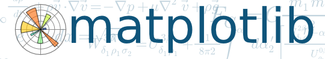

# Aquí comenzamos...

Matplotlib es una librería de Python para el trazo de gráficas, desarrollada inicialmente por 
John Hunter. Tiene una sintaxis inspirada en MATLAB y comparte mucha similitud en las principales 
funciones, aunque Matplotlib permite un desarrollo de gráficas utilizando el enfoque orientado 
a objetos, lo cual le convierte en una herramienta muy potente.

