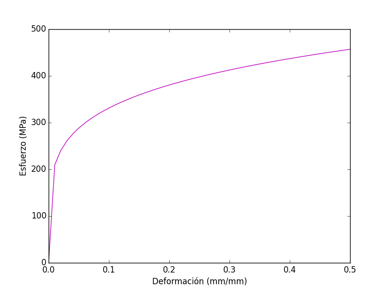

# Una primera aproximación: utilizando pylab

Este primer capítulo tiene como objetivo mostrar algunas de las capacidades de Matplotlib de manera 
breve y un tanto *superficial*, utilizando la interfaz de pylab, esto para familiarizar al lector 
con la sintaxis y el uso de algunas funciones elementales.

El módulo `pylab` integra las capacidades gráficas de Matplotlib con algunas utilidades de NumPy, 
proporcionando de esta manera una interfaz muy parecida a MATLAB para el manejo de gráficas.

En este capítulo vamos a suponer que, antes de todo, se ha importado pylab de la siguiente manera:

```python
from pylab import *
```

Lo anterior nos permitirá disponer de todas las funciones de pylab dentro de  nuestro script.

Luego, graficar nuestro primer ejemplo será tan sencillo como escribir.

```python
plot([1,-2,5,-2,1,0,3])
show()
```


La función `plot`, en el caso anterior, recibe como argumento un arreglo de valores numéricos, que 
puede ser un lista de Python ordinaria, una tupla, y de manera más común un array de NumPy. La función 
`show` permite mostrar en pantalla la linea o gráfica que se ha creado con `plot`.

Ahora, como se ha mencionado, `pylab` también permite utilizar funciones de NumPy para la definición 
de arrays. Por ejemplo, con `linspace` podemos crear un vector de valores numéricos:

```python
linspace(a,b,n)
```

Siendo **a** el extremo inferior, **b** el extremo superior, y **n** el número de particiones en el intervalo 
{$$}[a,b]{/$$}. Por ejemplo:

```python
>>> linspace(1,10,10)
array([  1.,   2.,   3.,   4.,   5.,   6.,   7.,   8.,   9.,  10.])
```

Luego, a estos arrays de NumPy podemos aplicarles funciones matemáticas predefinidas, por ejemplo:

```python
>>> x = linspace(0,2*pi,10)
>>> y = cos(x)
>>> x
array([ 0.        ,  0.6981317 ,  1.3962634 ,  2.0943951 ,  2.7925268 ,
        3.4906585 ,  4.1887902 ,  4.88692191,  5.58505361,  6.28318531])
>>> y
array([ 1.        ,  0.76604444,  0.17364818, -0.5       , -0.93969262,
       -0.93969262, -0.5       ,  0.17364818,  0.76604444,  1.        ])
```

Con lo anterior crearemos nuestra primer gráfica de una función matemática:

```python
x = linspace(0,10)
y = cos(x)
plot(x,y)
show()
```


Note que a `linspace` no le hemos indicado el número de particiones del intervalo, con lo cual 
se toma por default un valor de 50.

Podemos cambiar el color y estilo de línea pasando una cadena de dos caracteres como tercer argumento, 
donde el primer caracter indica el color y el segundo el símbolo a utilizar, 
por ejemplo:

```python
x = linspace(0,10)
y = cos(x)
plot(x,y,"ro")
show()
```


Puede consultar los caracteres válidos para el color y estilo de línea en la documentación 
de la función [plot](http://matplotlib.org/api/pyplot_api.html#matplotlib.pyplot.plot).

Es posible también especificar el color y estilo utilizando [keyword arguments](https://docs.python.org/2/tutorial/controlflow.html#keyword-arguments) dentro de la función plot:

```python
plot(x,y,linestyle="--",color="k")
```

Además, el color también puede especificarse utilizando la notación RGBA y la notación hexadecimal, 
por ejemplo, las siguientes instrucciones son equivalentes:

```python
plot(x,y,color="r")
plot(x,y,color="#FF0000")
plot(x,y,color=(1,0,0,1))
```

Podemos incluir etiquetas en los ejes utilizando las funciones `xlabel` y `ylabel`. 
Por ejemplo:

```python
K = 525
n = 0.2
e = linspace(0,0.5)
s = K*e**n;
plot(e,s,'m')
xlabel(u"Deformación (mm/mm)")
ylabel(u"Esfuerzo (MPa)")
show()
```



Incluso se puede utilizar código TeX en las etiquetas y título de la gráfica:

```python
K = 525
n = 0.2
e = linspace(0,0.5)
s = K*e**n;
plot(e,s,'m')
xlabel(r"$\varepsilon$ (mm/mm)")
ylabel(r"$\sigma$ (MPa)")
title(r"Acero SAE 1008: $\sigma = K \varepsilon^n$")
show()
```


Para poder graficar en dos o más axes se puede utilizar la función `subplot` que permite 
crear un arreglo de axes, véase el ejemplo a continuación:

	t = linspace(0,2)
	x = 12*t**3 - 18*t**2 + 2*t + 5
	v = diff(x)
	# Gráfica de posición
	subplot(2,1,1)
	plot(t,x,"b")
	ylabel(u"Posición (m)")
	# Gráfica de velocidad
	subplot(2,1,2)
	plot(t[:-1],v,"g")
	xlabel("Tiempo (s)")
	ylabel(u"Velocidad (m/s)")
	show()


La función `subplot` recibe tres argumentos, los dos primeros especifican el número de filas y columnas 
del arreglo de axes, respectivamente, y el tercer argumento indica la posición del axes a utilizar.
La función [diff](http://docs.scipy.org/doc/numpy-1.10.0/reference/generated/numpy.diff.html) calcula 
la n-ésima derivada numérica de un vector dado.
