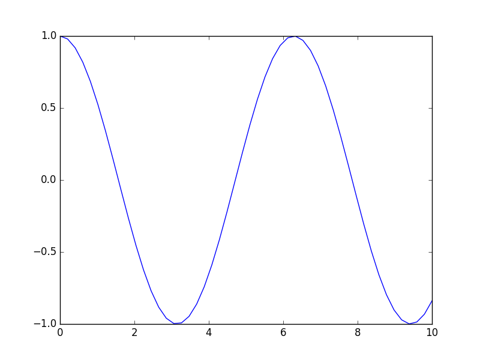
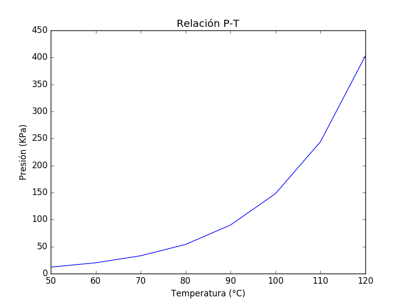
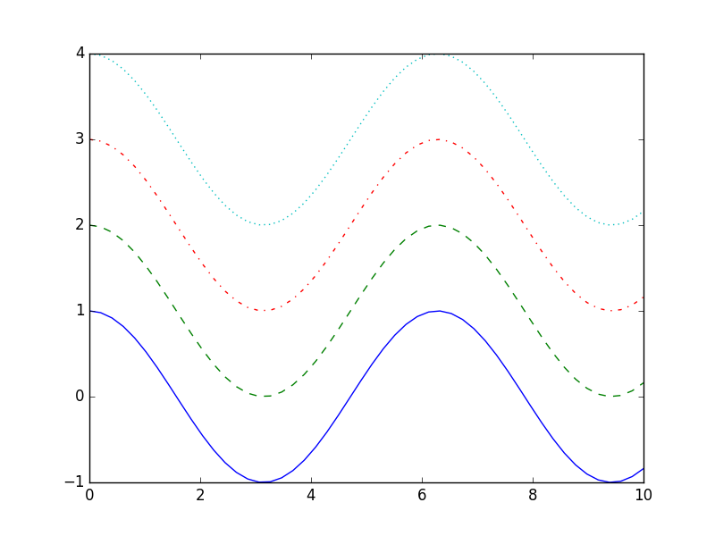
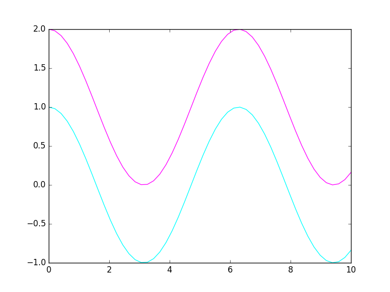
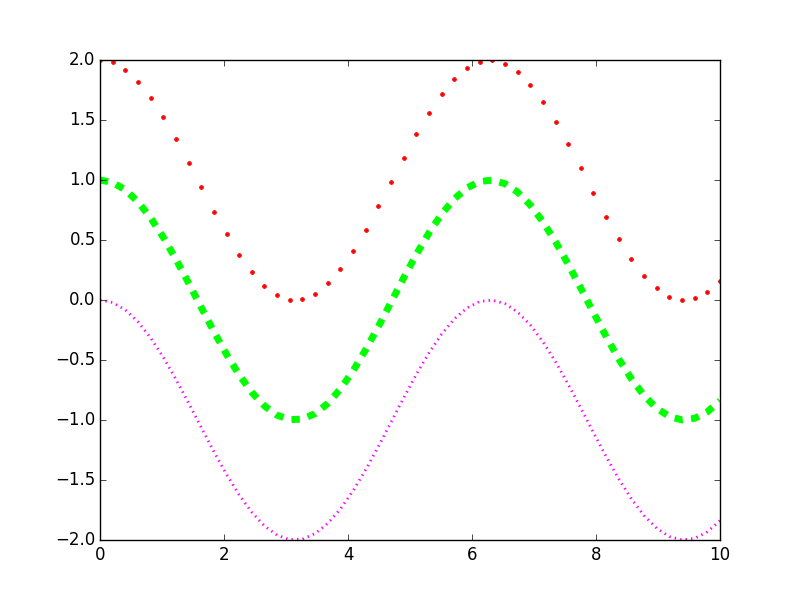

# Pyplot y lo básico

En el Capítulo 2 vimos una introducción a `pylab`, un módulo de matplotlib que integra 
las utilidades gráficas del módulo `pyplot` y de la librería NumPy en un mismo *espacio de nombres*. 
El uso de `pylab` hace recordar mucho la sintaxis y la *filosofía de programación* de MATLAB. 
Por ello (y por razones que iremos conociendo posteriormente) en el entorno de Matplotlib es 
preferible utilizar `pyplot` y `NumPy` cómo módulos independientes, permitiendo una 
estructuración más limpia de código, diferenciando la parte de proceso de datos y la 
de graficación/visualización.

Un código típico utilizando pylab sería:

	from pylab import *

	x = linspace(0,10)
	y = cos(x)

	plot(x,y,lw=2,ls="--")
	xlabel("Tiempo (s)")
	ylabel("Amplitud (mm)")
	show()

¿Y utilizando pyplot + NumPy?

	import matplotlib.pyplot as plt
	import numpy as np

	x = np.linspace(0,10)
	y = np.cos(x)

	plt.plot(x,y,lw=2,ls="--")
	plt.xlabel("Tiempo (s)")
	plt.ylabel("Amplitud (mm)")
	plt.show()

Ambos códigos producen exactamente lo mismo. 

Ahora veremos una tercera forma (*mejorada*) de hacer lo anterior:

	import matplotlib.pyplot as plt
	import numpy as np

	x = np.linspace(0,10)
	y = np.cos(x)

	fig = plt.figure()
	ax = fig.add_subplot(111)

	ax.plot(x,y,lw=2,ls="--")
	ax.set_xlabel("Tiempo (s)")
	ax.set_ylabel("Amplitud (mm)")

	plt.show()

Y sí, en este texto vamos a utilizar esta *manera* de hacer las cosas, ¿la diferencia?: 
objetos, métodos y esas cosas propias de la programación orientada a objetos, que nos 
permitirá *organizar* nuestro código de una mejor manera, sobre todo cuando este 
tiende a ser extenso. De manera breve, lo que se hace es instanciar un objeto de 
la clase `Figure`, que es básicamente el objeto gráfico principal o lo que denominaríamos como 
*ventana*, y posteriormente se utilizan métodos de clase para crear un `Axes` y utilizar 
sus métodos para trazar la gráfica correspondiente y las etiquetas o leyendas necesarias.

Para las secciones siguientes se asumirá que en todo momento se han importado el módulo 
`pyplot` y `NumPy` y que al final del código se ha incluido la instrucción 
`plt.show()` para mostrar lo que se ha graficado.

	import matplotlib.pyplot as plt
	import numpy as np
	# .
	# .
	# .
	plt.show()

## Coordenadas rectangulares

Hemos estado utilizando este tipo de gráficas en todos los ejemplos anteriores, entendemos 
por coordenadas rectangulares aquellas en donde cada punto del plano o espacio está dado 
por sus coordenadas (x,y) o (x,y,z) y las cuales hemos tenido *hasta en la sopa* desde nuestro 
primer curso de álgebra en el nivel secundario. Por ahora vamos a tomar el caso bidimensional, 
y en la mayoría de situaciones vamos a graficar un array que contiene los valores de la variable 
independiente (digamos *x*) contra un array que contiene los valores de la variable dependiente 
(digamos *f(x)*), utilizando, claro está, la función `plot`.

Por ejemplo supongamos que queremos graficar la función {$$}f(x)=x^2 sin(x){/$$} en el intervalo 
{$$}[0,2\pi]{/$$}. Primero debemos crear el vector o array de la variable independiente en 
el intervalo de interés, para ello podemos utilizar `linspace`:

	x = np.linspace(0,2*np.pi)

Enseguida definimos el array de la función o variable dependiente:

	y = (x**2)*(np.sin(x))

Ahora creamos el objeto `figure`:

	fig = plt.figure()

Utilizando el método `add_subplot` del objeto `fig` creamos el axes a utilizar:

	ax = fig.add_subplot(111)

Con nuestro axes creado, podemos utilizar el método `plot` para trazar la gráfica correspondiente:

	ax.plot(x, y)

Finalmente debemos utilizar la instrucción `plt.show()` para mostrar las gráficas que hemos generado. Juntando 
todo el código anterior se tiene:

	x = np.linspace(0,10)
	y = np.cos(x)

	fig = plt.figure()
	ax = fig.add_subplot(111)

	ax.plot(x, y)

## Etiquetas básicas (xlabel, ylabel & title)

Naturalmente una gráfica sin información extra más que las líneas trazadas es inútil desde donde se vea, porque cuando 
vamos a graficar algo el objetivo es transmitir información legible y en cierto punto amigable a terceros. Para ello 
en una gráfica se debe incluir información acerca de los datos que estamos representando.

En casi cualquier gráfica que veamos en libros, artículos o cualquier otro tipo de publicación vamos a tener al 
menos etiquetados los ejes coordenados, y una título o pequeña descripción que muestre lo que se representa. 
Para colocar esa información básica en una gráfica, Matplotlib proporciona los métodos `set_xlabel`, `set_ylabel` y 
`set_title` de la clase `Axes`, que de manera respectiva, colocan una etiqueta en el eje horizontal, una etiqueta en el 
eje vertical y un título en la parte superior del `Axes`.

En el siguiente código se muestra cómo colocar las etiquetas mencionadas anteriormente:

	T = [50, 60, 70, 80, 90, 100, 110, 120]
	P = [12, 20, 33, 54, 90, 148, 244, 403]

	fig = plt.figure()
	ax = fig.add_subplot(111)

	ax.plot(T, P)
	ax.set_xlabel(u"Temperatura (°C)")
	ax.set_ylabel(u"Presión (KPa)")
	ax.set_title(u"Relación P-T")

## Estilos, colores y grosores de líneas

Estilizar líneas es una cuestión muy común, puesto que muchas veces es necesario diferenciar 
una serie de datos de otra mediante su aspecto. Para ello Matplotlib dispone de algunas 
utilidades para proporcionar grosores, colores y estilos a una línea.

Existen cuatro estilos de líneas en Matplotlib: sólida, discontinua, de guión-punto y punteada.
Estos estilos pueden establecerse mediante el *keyword argument* `linestyle`.

	x = np.linspace(0,10)
	y = np.cos(x)

	fig = plt.figure()
	ax = fig.add_subplot(111)

	ax.plot(x, y, linestyle="-")
	ax.plot(x, y+1, ls="--")
	ax.plot(x, y+2, ls="-.")
	ax.plot(x, y+3, ls=":")

Note que el *keyword argument* `linestyle` puede abreviarse como `ls` y sigue funcionando 
correctamente.

Los colores de una línea pueden indicarse utilizando el *keyword argument* `color` y 
pasándole en este una cadena hexadecimal o bien una tupla de tres valores con los valores 
correspondientes al modelo RGB.

	x = np.linspace(0,10)
	y = np.cos(x)

	fig = plt.figure()
	ax = fig.add_subplot(111)

	ax.plot(x, y, color=(0,1,1))
	ax.plot(x, y+1, color="#ff00ff")

## Coordenadas polares

Para trazar gráficas en coordenadas polares en Matplotlib se utiliza también el método `plot`, pero cuando se 
crea el axes debemos cambiar el tipo de proyección que utilizaremos a coordenadas polares, lo cual puede hacerse 
de las utilizando el *keyword argument* `projection`:

	fig = plt.figure()
	polar_axes = fig.add_subplot(111, projection="polar")

O bien utilizando `polar`:

	fig = plt.figure()
	polar_axes = fig.add_subplot(111, polar=True)

Por ejemplo, trazando la rosa polar {$$}r(\theta) = 0.25\,\cos(3\theta){/$$}:

	theta = np.linspace(0,2*np.pi,1000)
	r = 0.25*np.cos(3*theta)

	fig = plt.figure()
	ax = fig.add_subplot(111, polar=True)

	ax.plot(theta, r)

## Scatter Plots

## Gráficas de barras

## Gráficas de pastel

